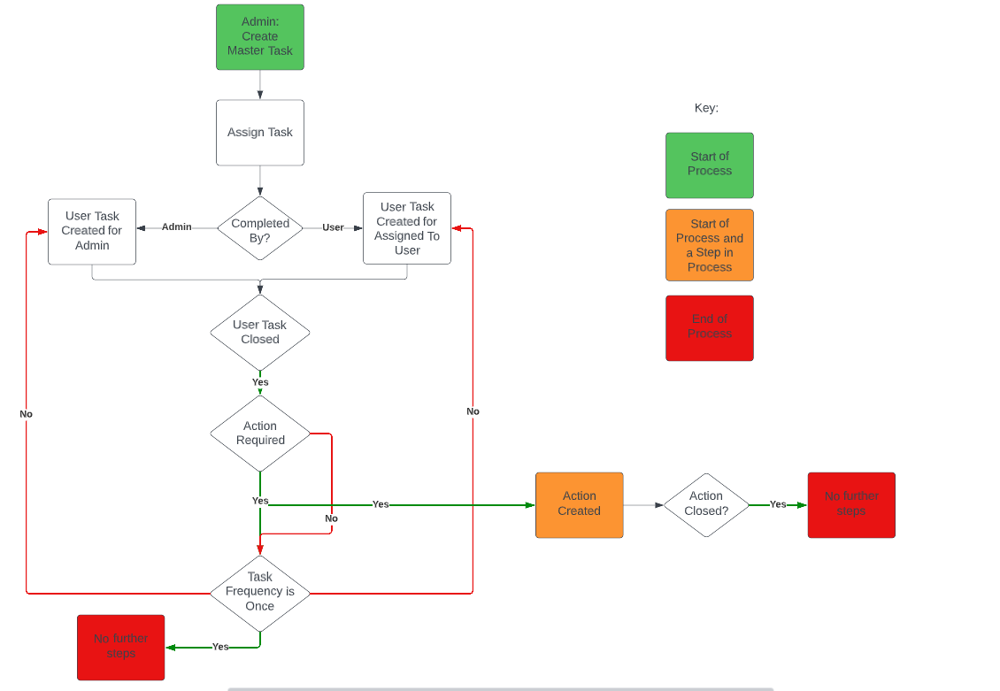
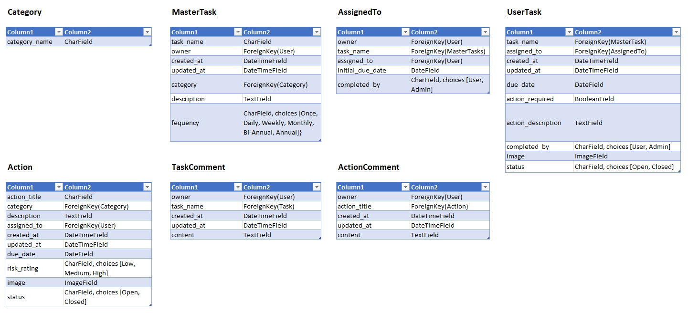

# DCMS - Digital Compliance Management System

The live link for the site can be found here - https://project5-dcms-react.herokuapp.com/

The live link for the API can be found here - https://project5-dcms-drf-api.herokuapp.com/

# Table of Contents
- [Overview](#overview)
- [User Stories](#user-stories)
- [Site Navigation Flowchart](#site-navigation-flowchart)
- [Database Schema](#database-schema)
- [Languages Used](#languages-used)
- [Testing](#testing)
  - [Manual Test of User Stories](#manual-test-of-user-stories)
  - [Validator Testing](#validator-testing)
  - [Unfixed Bugs](#unfixed-bugs)
- [Libraries and Programs Used](#libraries-and-programs-used)
- [Deployment](#deployment)
- [Requirements](#requirements)
- [Credits](#credits)
  - [Content](#content)

# Overview

This site was developed to address a problem which occurred during my previous employment as a Senior Account Manager for a Health and Safety Consultancy. I worked with clients with a large estate of sites throughout the UK. The central health and safety team did not know whether any of the compliance checks were being completed unless they attended site and reviewed the paper checklists used to record the completion of tasks or actions. I have created this site as a way of solving this issue.

# User Stories

*Categories*

- View Categories List: As a **site admin** I can **view the categories list** so that **I can ensure that all appropriate categories are available to be allocated to a task or action**.
- Add Categories: As a **site admin** I can **create a category** so that **it can be allocated to a task or action**.
- Edit Categories: As a **site admin** I can **edit a category** so that **the correct category can be allocated to a task or action**.
- Delete Categories: As a **site admin** I can **delete a category** so that **it is no longer available to be allocated to a task or action**.

*Master Tasks*

- View Master Task List: As a **site admin** I can **view the master task list** so that **to ensure all users have been allocated the appropriate tasks**.
- View Master Task Details: As a **site admin** I can **view the master task details** so that **to ensure that the correct information has been set on a master task**.
- Add Master Task: As a **site admin** I can **add a master task** so that **I am able to allocate a master task to a user**.
- Edit Master Task: As a **site admin** I can **edit a master task** so that **I am able to update a master task if any of the requirements change**.
- Delete Master Task: As a **site admin** I can **delete a master task** so that **it is no longer available to be allocated to a user**.
- Search for Master Tasks:	As a **site admin** I can **search for master tasks** so that **so it is easy to find the master task which I am looking for**.

*Assign Tasks*

- Allocate Master Task to User: As a **site admin** I can **allocate a master task to a user** so that **so a user task can be allocated to them to ensure that an activity is being completed**.
- Set Completed By: As a **site admin** I can **set who the task is to be completed by** so that **either the admin or the user is aware that a task requires completing by them**.

*User Tasks*

- Add User Task: As a **site admin** I can **automatically create a user task once a master task has been allocated** so that **I know a user task has been created which requires completion**.
- View User Task List: As a **site user/site admin** I can **view the user tasks which are to be completed by me** so that **I am aware what tasks I need to completed**.
- View Overdue User Task List: As a **site user/site admin** I can **view the overdue user tasks which are to be completed by me** so that **I can prioritise completing tasks which are overdue**.
- Filter User Tasks: As a **site user/site admin** I can **filter user tasks** so that **so it is easy to find the user task which I am looking for**.
- Search for User Tasks: As a **site user/site admin** I can **search for user tasks** so that **so it is easy to find the user task which I am looking for**.
- View User Task Details: As a **site user/site admin** I can **view a user tasks details** so that **I am aware what tasks I need to completed**.
- Update User Task Status: As a **site user/site admin** I can **update a user tasks status** so that **I can record whether a task has been completed or is in progress**.
- Add Image to User Task: As a **site user/site admin** I can **add an image to a user task** so that **I can provide additional evidence that a task has been completed or that an issue was identified**.

*User Tasks: Comments*

- View Task Comments: As a **site user/site admin** I can **view task comments** so that **I can read the log of detailed information recorded about a task**.
- Add Task Comment: As a **site user/site admin** I can **add a comment to a task** so that **I can record whether an issue has been raised or detail information about the completion of a task**.
- Edit Task Comment: As a **site user/site admin** I can **edit a task comment** so that **I can update an error made in a comment**.
- Delete Task Comment: As a **site user/site admin** I can **delete a task comment** so that **I can delete a comment which has been incorrectly submitted**.
- Task Status Update Comment: As a **site user/site admin** I can **automatically add a comment to detail a change in an tasks status** so that **the comments have a log of any changes to the status of the task**.

*Actions*

- View Action List: As a **site user/site admin** I can **view the actions which are to be completed by me** so that **I am aware what actions I need to completed**.
- View Action Details: As a **site user/site admin** I can **view an actions details** so that **I am aware of the details of the action which I need to completed**.
- Add Action: As a **site user/site admin** I can **add an action** so that **I can record any issues identified so they can be addressed at a later date**.
- Add Action related to a Task: As a **site user/site admin** I can **raise an action if an issue was raise when completing a task** so that **I can record any issues identified when completing a task so they can be addressed at a later date**.
- Edit Action: As a **site user/site admin** I can **edit an action** so that **I am able to update an action if any of the requirements change**.
- Delete Action: As a **site user/site admin** I can **delete an action** so that **I can delete an action which has been incorrectly submitted**.

*Actions: Comments*

- View Action Comments: As a **site user/site admin** I can **view action comments** so that **I can read the log of detailed information recorded about an action**.
- Add Action Comment: As a **site user/site admin** I can **add a comment to an action** so that **I can log the progress of the completion of an action**.
- Edit Action Comment: As a **site user/site admin** I can **edit an action comment** so that **I can update an error made in a comment**.
- Delete Action Comment: As a **site user/site admin** I can **delete an action comment** so that **I can delete a comment which has been incorrectly submitted**.
- Action Status Update Comment: As a **site user/site admin** I can **automatically add a comment to detail a change in an actions status** so that **the comments have a log of any changes to the status of the action**.

The user stories where managed in a Kanban board which was created in [GitHub Projects](https://github.com/users/TuckerFaulk/projects/5/views/1?visibleFields=%5B%22Title%22%2C%22Assignees%22%2C%22Status%22%2C%22Labels%22%2C%22Milestone%22%5D). User stories were then prioritized with the MoSCoW approach and labels where used to manage this. The kanban board was split into five columns to manage the various stages of development:

1. To do: This item hasn't been started
2. In Progress - DRF API: This item is actively being worked on in the DRF API
3. To do - React: This item has tasks related to the React App which have not been started
4. In Progress - React: This item is actively being worked on in the React App
5. Done: All tasks related to the DRF API and the React App have been completed

# Site Navigation Flowchart



# Database Schema

Data normalisation to structure each relational model to help reduce data redundancy and improve data integrity was used after initially setting out all of the information required for the site.



# Languages Used

- Python
- SQL (Postgres)

# Testing

## Manual Test of User Stories

| User Story Tested |  Passed |
|-------|:--------:|
|View Categories List: As a **site admin** I can **view the categories list** so that **I can ensure that all appropriate categories are available to be allocated to a task or action**.|☑|
|Add Categories: As a **site admin** I can **create a category** so that **it can be allocated to a task or action**.|☑|
|Edit Categories: As a **site admin** I can **edit a category** so that **the correct category can be allocated to a task or action**.|☑|
|Delete Categories: As a **site admin** I can **delete a category** so that **it is no longer available to be allocated to a task or action**.|☑|
|View Master Task List: As a **site admin** I can **view the master task list** so that **to ensure all users have been allocated the appropriate tasks**.|☑|
|View Master Task Details: As a **site admin** I can **view the master task details** so that **to ensure that the correct information has been set on a master task**.|☑|
|Add Master Task: As a **site admin** I can **add a master task** so that **I am able to allocate a master task to a user**.|☑|
|Edit Master Task: As a **site admin** I can **edit a master task** so that **I am able to update a master task if any of the requirements change**.|☑|
|Delete Master Task: As a **site admin** I can **delete a master task** so that **it is no longer available to be allocated to a user**.|☑|
|Search for Master Tasks	As a **site admin** I can **search for master tasks** so that **so it is easy to find the master task which I am looking for**.|☑|
|Allocate Master Task to User: As a **site admin** I can **allocate a master task to a user** so that **so a user task can be allocated to them to ensure that an activity is being completed**.|☑|
|Set Completed By: As a **site admin** I can **set who the task is to be completed by** so that **either the admin or the user is aware that a task requires completing by them**.|☑|
|Add User Task: As a **site admin** I can **automatically create a user task once a master task has been allocated** so that **I know a user task has been created which requires completion**.|☑|
|View User Task List: As a **site user/site admin** I can **view the user tasks which are to be completed by me** so that **I am aware what tasks I need to completed**.|☑|
|View Overdue User Task List: As a **site user/site admin** I can **view the overdue user tasks which are to be completed by me** so that **I can prioritise completing tasks which are overdue**.|☑|
|Filter User Tasks: As a **site user/site admin** I can **filter user tasks** so that **so it is easy to find the user task which I am looking for**.|☑|
|Search for User Tasks: As a **site user/site admin** I can **search for user tasks** so that **so it is easy to find the user task which I am looking for**.|☑|
|View User Task Details: As a **site user/site admin** I can **view a user tasks details** so that **I am aware what tasks I need to completed**.|☑|
|Update User Task Status: As a **site user/site admin** I can **update a user tasks status** so that **I can record whether a task has been completed or is in progress**.|☑|
|Add Image to User Task: As a **site user/site admin** I can **add an image to a user task** so that **I can provide additional evidence that a task has been completed or that an issue was identified**.|☑|
|View Task Comments: As a **site user/site admin** I can **view task comments** so that **I can read the log of detailed information recorded about a task**.|☑|
|Add Task Comment: As a **site user/site admin** I can **add a comment to a task** so that **I can record whether an issue has been raised or detail information about the completion of a task**.|☑|
|Edit Task Comment: As a **site user/site admin** I can **edit a task comment** so that **I can update an error made in a comment**.|☑|
|Delete Task Comment: As a **site user/site admin** I can **delete a task comment** so that **I can delete a comment which has been incorrectly submitted**.|☑|
|Task Status Update Comment: As a **site user/site admin** I can **automatically add a comment to detail a change in an tasks status** so that **the comments have a log of any changes to the status of the task**.|☑|
|View Action List: As a **site user/site admin** I can **view the actions which are to be completed by me** so that **I am aware what actions I need to completed**.|☑|
|View Action Details: As a **site user/site admin** I can **view an actions details** so that **I am aware of the details of the action which I need to completed**.|☑|
|Add Action: As a **site user/site admin** I can **add an action** so that **I can record any issues identified so they can be addressed at a later date**.|☑|
|Add Action related to a Task: As a **site user/site admin** I can **raise an action if an issue was raise when completing a task** so that **I can record any issues identified when completing a task so they can be addressed at a later date**.|☑|
|Edit Action: As a **site user/site admin** I can **edit an action** so that **I am able to update an action if any of the requirements change**.|☑|
|Delete Action: As a **site user/site admin** I can **delete an action** so that **I can delete an action which has been incorrectly submitted**.|☑|
|View Action Comments: As a **site user/site admin** I can **view action comments** so that **I can read the log of detailed information recorded about an action**.|☑|
|Add Action Comment: As a **site user/site admin** I can **add a comment to an action** so that **I can log the progress of the completion of an action**.|☑|
|Edit Action Comment: As a **site user/site admin** I can **edit an action comment** so that **I can update an error made in a comment**.|☑|
|Delete Action Comment: As a **site user/site admin** I can **delete an action comment** so that **I can delete a comment which has been incorrectly submitted**.|☑|
|Action Status Update Comment: As a **site user/site admin** I can **automatically add a comment to detail a change in an actions status** so that **the comments have a log of any changes to the status of the action**.|☑|

## Validator Testing

- CI Python Linter: No errors were found when passing through the CI Python Linter.

## Unfixed Bugs

There were no unfixed bugs.

# Libraries and Programs Used

- Github: Store Repository
- Gitpod: IDE
- Heroku: Site Deployment
- Cloudinary: Serving static media files
- ElephantSQL: PostgreSQL database hosting
- Django/Django REST Framework: Backend database and API
- Google Chrome, Microsoft Edge, Mozilla Firefox, Safari: Site testing on alternative browsers
- Chrome Dev Tools: Debugging of the site
- Microsoft OneNote: Planning notes for the project
- Lucid Charts: Planning the site process with a flow diagram

# Deployment

This project was deployed on Heroku using Code Institute's Videos. After creating a GitHub repository, the steps taken to create the Heroku App were:

**Create Database**

1. In ElepahantSQL, click "Create New instance"
2. Set up the Tiny Turtle plan, select the nearest datacenter and click "Review"
3. Copy the new DATABASE_URL

**Connect Cloudinary**

1. In the terminal: install dj-cloudinary-storage
2. Add CLOUDINARY_URL to the env.py file
3. In settings.py, update the apps to include cloudinary-storage
4. Below the import statements, add the following variables for Cloudinary:
```
CLOUDINARY_STORAGE = {
    'CLOUDINARY_URL': os.environ.ger('CLOUDINARY_URL')
}
MEDIA_URL = '/media/'
DEFAULT_FILE_STORAGE = 'cloudinary_storage.storage.MediaCloudinartStorage'
```
5. Below INSTALLED_APPS, set site ID:
```
SITE_ID = 1
```

**Create the Heroku App**

1. On the Heroku dashboard, click "Create a new app".
2. Go to the config vars in settings and paste in the new DATABASE_URL and CLOUDINARY_URL

**Connect Project to ElepahantSQL**

1. In the terminal: install dj_database_url and psycopg2
2. In settings.py: import dj-database_url and import os
3. Updated the DATABASES variable to:
```
DATABASES = {
    'default': ({
       'ENGINE': 'django.db.backends.sqlite3',
        'NAME': BASE_DIR / 'db.sqlite3',
    } if 'DEV' in os.environ else dj_database_url.parse(
        os.environ.get('DATABASE_URL')
    )
    )
}
```
4. Add in the env.py:  
5. os.environ.setdefault("DATABASE_URL", "<your PostgreSQL URL here>")
6. Temporarily comment out the environment variable to connect gitpod to your external database.
7. In ElepahantSQL browser, check if the database is now connected 
8. If connected, migrate the database and create a superuser

**Deploy on Heroku**

*In gitpod workspace*

1. In the terminal, install gunicorn
2. Update the requirements.txt file
3. Create Procfile
4. In settings.py 
  a. Add the Heroku app to the ALLOWED_HOSTS variable:
    ```
    os.environ.get('ALLOWED_HOST'),
    'localhost',
    ``` 
  b. Add corsheaders to INSTALLED_APPS
  d. Add corsheaders middleware to the top of MIDDLEWARE:
  ```
  'corsheaders.middleware.CorsMiddleware',
  ```
  e. Set ALLOWED_ORIGIN to make network requests
  f. Below BASE_DIR, create the REST_FRAMEWORK, and include page pagination to improve app loading times, pagination count, and date/time format:
  ```
  REST_FRAMEWORK = {
      'DEFAULT_AUTHENTICATION_CLASSES': [(
          'rest_framework.authentication.SessionAuthentication'
          if 'DEV' in os.environ
          else 'dj_rest_auth.jwt_auth.JWTCookieAuthentication'
      )],
      'DEFAULT_PAGINATION_CLASS':
          'rest_framework.pagination.PageNumberPagination',
      'PAGE_SIZE': 10,
      'DATETIME_FORMAT': '%d %b %Y',
  }
  ```
  g. Set the default renderer to JSON:
  ```
  if 'DEV' not in os.environ:
      REST_FRAMEWORK['DEFAULT_RENDERER_CLASSES'] = [
          'rest_framework.renderers.JSONRenderer',
      ]
  ```
  h. Add the following, setting the JWT_AUTH_SAMESITE to 'None'
  ```
  REST_USE_JWT = True
  JWT_AUTH_SECURE = True
  JWT_AUTH_COOKIE = 'my-app-auth'
  JWT_AUTH_REFRESH_COOKIE = 'my-refresh-token'
  JWT_AUTH_SAMESITE = 'None'
  ```
  i. Remove the value for SECRET_KEY and replace with: SECRET_KEY = os.getenv('SECRET_KEY')
  j. Below ALLOWED_HOST, added the CORS_ALLOWED variable.
  ```
  if 'CLIENT_ORIGIN' in os.environ:
    CORS_ALLOWED_ORIGINS = [
        os.environ.get('CLIENT_ORIGIN')
    ]

  if 'CLIENT_ORIGIN_DEV' in os.environ:
      extracted_url = re.match(r'^.+-', os.environ.get('CLIENT_ORIGIN_DEV', ''), re.IGNORECASE).group(0)
      CORS_ALLOWED_ORIGIN_REGEXES = [
          rf"{extracted_url}(eu|us)\d+\w\.gitpod\.io$",
      ]
  ```
  k. Set the debug value to True if the DEV environment variable exists:
  ```
  DEBUG = 'DEV' in os.environ
  ```
5. In env.py
  a. Add SECRET_KEY
  b. Comment DEV back in 
6. Update the requirements.txt file
7. Migrate the database
8. Add, commit and push the code to github 

*In Heroku*
1. Add SECRET_KEY, ALLOWED_HOST, CLIENT_ORIGIN and CLIENT_ORIGIN_DEV to the config vars
2. Manually re-deploy the app to github 

## Requirements

-asgiref==3.6.0
-cloudinary==1.32.0
-dj-database-url==0.5.0
-dj-rest-auth==2.1.9
-Django==3.2.18
-django-allauth==0.44.0
-django-cloudinary-storage==0.3.0
-django-cors-headers==3.14.0
-django-filter==22.1
-djangorestframework==3.14.0
-djangorestframework-simplejwt==5.2.2
-gunicorn==20.1.0
-oauthlib==3.2.2
-Pillow==9.4.0
-psycopg2==2.9.5
-PyJWT==2.6.0
-python3-openid==3.2.0
-pytz==2022.7.1
-requests-oauthlib==1.3.1
-sqlparse==0.4.3

# Credits

I have again enjoyed learning with the Code Institute and completing my fifth assignment. I would like to thank my mentor Martina for her support, the CI Student Support Team and the CI Slack Community. Finally a big thank you to my girlfriend for her help with testing and the review of this site.

## Content

**Resources Used:**

- Code Institutes Walkthrough Videos
- Django and Django Rest documentation
- W3C Schools and Stack Overflow for general enquiries relating to Django

[Back to Top](#table-of-contents)